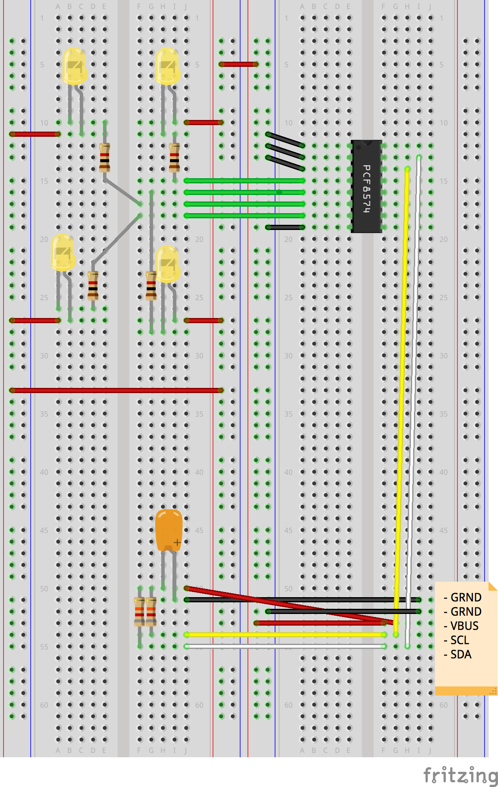

# I2C Expander - Verwendung mit LEDs

## I2C Verbindung aufbauen

	i2c_enable(NXT_PORT_S1);
	
	
## I2C Verbindung beenden

	void ecrobot_device_terminate()
	{
		i2c_disable(NXT_PORT_S1);
	}

## Beispiel: Schalte alle LEDs an
	
	#define LEDs_All_ON        0x0

	static U8 dataToSend = LEDs_All_ON;

	while (i2c_busy(NXT_PORT_S1) != 0);
	ecrobot_send_i2c(NXT_PORT_S1,0x20,dataToSend,&dataToSend,sizeof(dataToSend));

## Beispiel: Schalte alle LEDs aus
	
	#define LEDs_All_OFF        0xEF

	static U8 dataToSend = LEDs_All_OFF;

	while (i2c_busy(NXT_PORT_S1) != 0);
	ecrobot_send_i2c(NXT_PORT_S1,0x20,dataToSend,&dataToSend,sizeof(dataToSend));